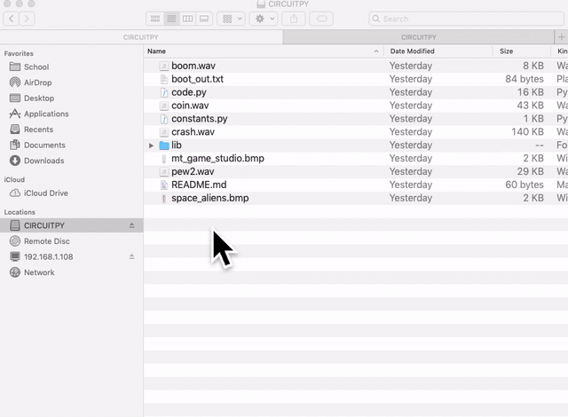

January 8th 2020
================
1. Created a DynamoDB table called "choclate_user" with email as my primary key

2. Created rows in the table to ensure that is working correctly. I used the following information: first_name, last_name and age of the user

3. I changed the capacity of my table from 5 to 1 in order to save money, as that is more than enough for the services I will be needing

4.

   Clearing the PyBadge and loading the CircuitPython UF2 file

Before doing anything else, you should delete everything already on your PyBadge and install the latest version of CircuitPython onto it. This ensures you have a clean build with all the latest updates and no leftover files floating around. Adafruit has an excellent quick start guide `here <https://learn.adafruit.com/adafruit-pybadge/installing-circuitpython>`_ to step you through the process of getting the latest build of CircuitPython onto your PyBadge. Adafruit also has a more detailed comprehensive version of all the steps with complete explanations `here <https://learn.adafruit.com/welcome-to-circuitpython/installing-circuitpython>`_ you can use, if this is your first time loading CircuitPython onto your PyBadge. 

Just a reminder, if you are having any problems loading CircuitPython onto your PyBadge, ensure that you are using a USB cable that not only provides power, but also provides a data link. Many USB cables you buy are only for charging, not transfering data as well. Once the CircuitPython is all loaded, come on back to continue the tutorial.
